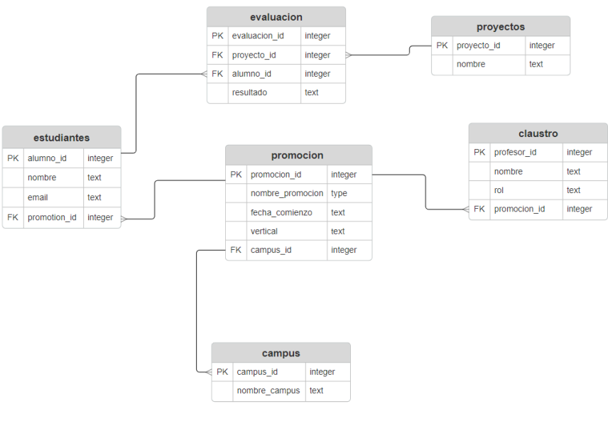

# Creación de base de datos relacional
Este proyecto consiste en crear una base de datos SQL de una escuela de programación. Los datos originales consistían en unos archivos csv sin normalizar donde se encontraban los datos de los profesores y alumnos. A partir de estos datos, se ha generado la base de datos postgreSQL y se ha subido al servidor render.

### Modelo entidad-relación y modelo de la base de datos:

Tras analizar los datos y pensar en la escabilidad, se ha planteado el siguiente diagrama relacional:

El diagrama relacional lleva a este modelo de base de datos:

### Creación de la base de datos
El repositorio consta de dos Jupyter Notebooks. El archivo [generar db](generar%20db.ipynb) genera una base de datos de tipo sqlite. El archivo [generar db_pg](generar%20db_pg.ipynb) genera una base de datos postgreSQL en el servidor local. Ambos Jupyter Notebooks tienen una estructura similar.
En primer lugar, se generan los dataframes necesarios mediante la biblioteca pandas de Python. Posteriormente se crean las tablas de postgreeSQL con la biblioteca psycopg2 con los siguientes datos en local:
- database="escuela", 
- user='postgres', 
- password='123456', 
- host='localhost', 
- port= '5432'

Estos datos deben concordar con la base de datos previamente creada en local, en este caso con pgAdmin 4.
Una vez creadas las tablas, se han rellenado las tablas en la base de datos con la biblioteca SQLalchemy.

### Alojamiento en servidor
La base de datos se ha alojado en un servidor remoto proporcionado por Render con los siguientes datos:
- Hostname: dpg-cl1ebtas1bgc73foev1g-a
- Port: 5432
- Database: escuela_x82i
- Username: escuela_x82i_user

### Backups
Además de la base de datos en la nube, hay dos backups en el repositorio: 
- [Backup en Postgre](escuela-backup.sql)
- [Backup en SQLite](escuela.db)

### Queries
En la carpeta de queries hay tres ejemplos de query para realizar en la base de datos:
- aptos_por_promocion: Muestra el número total de evaluaciones con calificación 'apto' en cada promoción.
- mejores_alumnos: Genera una lista con los mejores alumnos ordenados de más a menos cantidad de calificaciones 'apto'.
- apto_BBDD: Muestra los alumnos que han aprobado el proyecto de bases de datos.

### Autores
Este trabajo ha sido realizado por:
- Manuel Reina Fernández
- Joan Salvador Calabuig
- Raimundo Sieso Ortiz
- Maria Diana Noaghiul Barbulescu
- Pedro Javier Miranda Tejada
